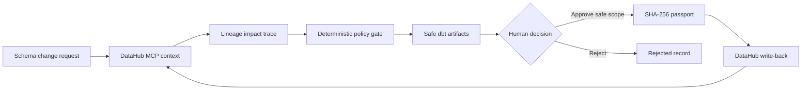

# ContextSeal

> **Every data change ships with proof, not confidence.**

ContextSeal is a DataHub-native certification agent for risky schema changes. It blocks a breaking rename before it reaches GitHub, turns the request into a safe staged migration package, and issues a durable change passport only after a human approves the safe scope.

In the judge path, the first thing you see is the blocked request, the downstream blast radius, the safe review bundle, and the passport payoff. The rest of the product explains why that verdict is grounded.

The demo story is now intentionally compressed to about 100 seconds: block the rename, show the blast radius, show the AI boundary, show the safe package, approve the safe scope, and end on the passport plus inherited decision.

[](https://github.com/zyganali-glitch/ContextSeal/actions/workflows/ci.yml)
[](LICENSE)
[](https://datahub.com/)

**[Open the judge-ready fixture demo](https://zyganali-glitch.github.io/ContextSeal/)** · [Türkçe README](README.tr.md)

Built as a clean-room entry for **Build with DataHub: The Agent Hackathon**. No pre-existing personal-project code is included.

## Why the judge path lands

- A risky rename is blocked before merge, not after damage.
- DataHub context shows the exact downstream blast radius and named risk findings.
- The optional AI panel is visible, bounded, and honest about runtime availability.
- ContextSeal generates a safe migration package and a reviewer-ready PR bundle instead of a destructive change.
- Human approval produces a durable passport that the next human or agent can inherit.

## What ships in the first minute

1. The blocked request and downstream blast radius.
2. The deterministic `80 / BLOCKED` verdict and named findings.
3. The explanation-only AI boundary.
4. The generated safe package and review handoff.
5. The passport and inherited decision loop.

## The problem

Code review and CI can inspect a repository. They usually cannot see that a field feeds a Looker dashboard three hops away, appears in observed production queries, carries a PII glossary term, powers an ML model, or belongs to another team. An AI coding agent can produce syntactically correct data code while still making an organizationally unsafe change.

DataHub already holds that missing context: schemas, lineage, ownership, governance terms, quality signals, incidents, and observed queries. ContextSeal makes that context an enforceable pre-merge decision.

## What ContextSeal does

1. Validates a typed change request.
2. Collects target, lineage, usage, ownership, governance, and quality evidence through DataHub MCP.
3. Traces every reachable downstream asset and preserves the path that explains the impact.
4. Calculates deterministic findings such as `BREAKING_LINEAGE`, `SENSITIVE_DATA`, `LIVE_QUERY_USAGE`, and `STALE_CONTEXT`.
5. Replaces a destructive operation with an expand–migrate–contract strategy.
6. Generates a dbt model, schema tests, rollback file, and impacted-owner briefing.
7. Requires a scoped human decision.
8. Creates a SHA-256 change passport covering the request, context, risk, artifacts, evidence, approval, and validity window.
9. Writes certification properties, a description, and a decision document back to DataHub only when every mutation gate is open.

## Honest evidence boundary

ContextSeal never collapses these states:

| State | Meaning |
| --- | --- |
| `PASS` | A named check or operation completed successfully. |
| `WARN` | Evidence exists but needs attention. |
| `FAIL` | A named check completed and failed. |
| `NOT_RUN` | The check or mutation did not run. |
| `STALE` | Context is older than policy allows. |
| `FIXTURE` | The result came from the public, synthetic judge fixture. |

The hosted/local fixture demo is real application execution against synthetic metadata. It is not presented as a live DataHub tenant. Live MCP capture and mutations are separately gated and recorded.

## Architecture



See [Architecture](docs/ARCHITECTURE.md), [Evidence Boundary](docs/EVIDENCE_BOUNDARY.md), and [Threat Model](docs/THREAT_MODEL.md).

## Sixty-second local demo

Requirements: Node.js 20 or newer.

```bash
npm install
npm test
npm run demo
npm start
```

Open <http://127.0.0.1:4173>, then:

1. Select **Analyze the demo change**.
2. Inspect the fixture-backed five-hop downstream impact trace and risk findings.
3. Select **Approve safe plan**.
4. Inspect the passport ID and evidence states.
5. Select **Prepare DataHub write-back**. In fixture mode, the application proves that operations were prepared while keeping write-back `NOT_RUN`.

Or use Docker:

```bash
docker compose up --build
```

## Live DataHub mode

### 1. Start DataHub and install the MCP launcher

Follow the official DataHub Quickstart and MCP documentation. DataHub Core exposes GMS at `http://localhost:8080`; the official open-source MCP server is launched locally with `uvx`, using stdio transport. DataHub Cloud uses its streamable HTTP MCP endpoint instead.

### 2. Configure ContextSeal

Copy `.env.example` to `.env`, then set:

```dotenv
CONTEXTSEAL_MODE=datahub
CONTEXTSEAL_HOST=127.0.0.1
DATAHUB_MCP_TRANSPORT=stdio
DATAHUB_MCP_COMMAND=uvx
DATAHUB_MCP_ARGS=["mcp-server-datahub@0.6.0"]
DATAHUB_GMS_URL=http://localhost:8080
DATAHUB_GMS_TOKEN=your-local-token
DATAHUB_MCP_MUTATIONS_ENABLED=false
CONTEXTSEAL_OPERATOR_TOKEN=
CONTEXTSEAL_ALLOWED_TARGET_URNS=["urn:li:dataset:(urn:li:dataPlatform:snowflake,retail.gold.customers,PROD)"]
```

Keep mutations disabled while validating search, entity, lineage, and query evidence. Enable them only for the final, approved write-back demonstration:

```dotenv
DATAHUB_MCP_MUTATIONS_ENABLED=true
```

ContextSeal launches the official local MCP process for each bounded operation and passes the mutation setting explicitly. Credentials must never be committed. For DataHub Cloud, set `DATAHUB_MCP_TRANSPORT=http` and provide the tenant MCP URL.

When `CONTEXTSEAL_MODE=datahub`, set a long random local bearer token in `CONTEXTSEAL_OPERATOR_TOKEN` before starting the server. The server will refuse to start unless that value is non-empty and `CONTEXTSEAL_ALLOWED_TARGET_URNS` is a non-empty JSON array. Live API requests must send `Authorization: Bearer <CONTEXTSEAL_OPERATOR_TOKEN>`.

### 3. Install ContextSeal structured properties

```bash
npm run datahub:seed
npm run datahub:properties
```

The `datahub:seed*` and `datahub:properties*` scripts wrap the pinned free helper path `uv run --with acryl-datahub==1.6.0.14`.

### 4. Run

```bash
npm start
```

The application calls DataHub MCP tools for entity context, downstream lineage, observed dataset queries, and bounded metadata mutations. The default judge path keeps the exact graph view fixture-backed unless a target-derived graph contract is exported separately. See [Live DataHub Setup](docs/LIVE_DATAHUB_SETUP.md) for the exact verification path and limitations.

The repository preserves historical disposable-local proof under `examples/outputs/`: an earlier synthetic-local run returned five downstream dataset-shaped results through live MCP across seeded local platforms, and wrote plus read back the approved status, risk score, passport ID, validity date, appended description, and decision document. Those artifacts remain useful for review, but they predate the reconciled final HEAD and are labeled historical until live proof is recaptured.

## MCP tools used

Read path:

- `get_entities`
- `list_schema_fields`
- `get_lineage`
- `get_lineage_paths_between`
- `get_dataset_queries`

Approved write-back path:

- `add_structured_properties`
- `update_description`
- `save_document`

The reusable workflow is canonically packaged as [`datahub-schema-change-certification`](skills/datahub-schema-change-certification/SKILL.md). The legacy local name [`contextseal-change-certification`](skills/contextseal-change-certification/SKILL.md) remains only as a compatibility alias while older prompts are migrated.

## Repository map

```text
src/core/       deterministic contracts, impact, risk, artifacts, passport
src/datahub/    MCP client, live evidence capture, bounded write-back
public/         dependency-free judge dashboard
config/         policy and DataHub structured-property definitions
examples/       synthetic graph, request, and generated evidence
skills/         reusable DataHub change-certification skill
tests/          contract, risk, lineage, passport, and MCP safety tests
docs/           architecture, judging, evidence, security, submission guides
docs/tr/        beginner-safe Turkish operator, Devpost, and video guides
```

## Validation

```bash
npm run demo:generate
npm run sandbox:generate
npm run pr:bundle
npm run validate
git diff --exit-code
```

`npm run validate` is read-only against committed artifacts. Generation is explicit and separate.

## Optional local AI copilot

The repo now ships an optional local Ollama adapter, a visible Local AI Copilot panel, and inspectable grounded AI artifacts. The deterministic verdict is still computed first. If AI is disabled or Ollama is unavailable, ContextSeal records `NOT_ENABLED` or `UNAVAILABLE` instead of inventing text.

```bash
npm run ai:probe
```

See [AI Runtime Decision](docs/AI_RUNTIME_DECISION.md) for the exact runtime and fallback contract.

Committed AI artifacts:

- `examples/outputs/generated/ai/contextseal-ai-input.json`
- `examples/outputs/generated/ai/contextseal-ai-output.json`
- `examples/outputs/generated/ai/contextseal-ai-output.md`

## PR review handoff contract

ContextSeal now includes a reviewer-ready PR handoff contract in [PR Review Packet](docs/PR_REVIEW_PACKET.md). The default path stays offline and token-free: `npm run pr:bundle` refreshes the committed PR body, checklist, and payload under `examples/outputs/pr/`.

```bash
npm run pr:bundle
npm run pr:bundle:check
npm run pr:draft -- --dry-run
```

`npm run pr:draft -- --dry-run` prepares the exact GitHub draft-PR request without using a token. A live draft PR call remains optional and explicit: the branch named in `examples/outputs/pr/pr-payload.json` must already exist on GitHub, and `GITHUB_TOKEN` is required before running `npm run pr:draft` without `--dry-run`.

The read-only validation suite re-checks repository integrity, Python mutation safety, the full Node suite, deterministic demo and sandbox artifacts, fixture HTTP smoke, PR bundle parity, and draft-PR dry-run behavior without rewriting committed artifacts.

`npm run validate` is read-only: it covers repository integrity, Python mutation-safety tests, the full Node regression suite, deterministic demo parity, committed sandbox-evidence freshness, fixture HTTP smoke, PR-bundle parity, and draft-PR request validation. The stricter live-proof validator remains a separate command:

```bash
npm run evidence:check
```

It is expected to stay `WARN` until the disposable-local live DataHub artifacts are recaptured from the reconciled final HEAD.

## Judge paths

- [Two-minute judge test path](docs/JUDGE_TEST_PATH.md)
- [Official criteria mapping](docs/JUDGING_MAP.md)
- [Claim-by-claim evidence map](docs/EVIDENCE_MANIFEST.md)
- [Build-period disclosure](docs/BUILD_PERIOD_DISCLOSURE.md)
- [Demo script](docs/DEMO_SCRIPT.md)
- [PR review packet contract](docs/PR_REVIEW_PACKET.md)
- [Devpost submission draft](docs/DEVPOST_SUBMISSION.md)

Turkish beginner guides:

- [What the operator must do](docs/tr/BENIM_YAPMAM_GEREKENLER.md)
- [Devpost submission guide](docs/tr/DEVPOST_BASVURU_REHBERI.md)
- [Demo recording guide](docs/tr/DEMO_VIDEO_CEKIM_REHBERI.md)

## Current scope

Implemented:

- Three change contracts: rename, drop, and type change
- Multi-hop downstream path reconstruction
- Deterministic risk policy
- Safe dbt artifact generation
- Human approval contract
- Hash-bound change passport
- MCP client, live evidence capture, and gated write-back operations
- Persistent local run/event records
- Responsive no-dependency dashboard
- Automated tests, CI, Docker, and complete judging documentation

Explicitly not claimed:

- Automatic production merge or deployment
- Production warehouse SQL execution
- Comprehensive SQL parsing
- Security certification
- Customer adoption or incident-reduction metrics
- Live DataHub proof until the operator completes and records the documented live run

## License

Apache License 2.0. See [LICENSE](LICENSE).
