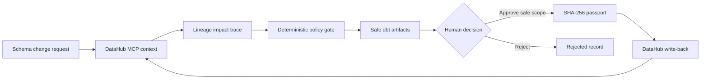

# ContextSeal

> **Every data change ships with proof, not confidence.**

ContextSeal is a DataHub-native certification agent for risky schema changes. It turns a proposed column rename, drop, or type change into a lineage-aware impact trace, an explainable policy verdict, a staged dbt migration, a scoped human decision, and a durable change passport written back to DataHub.

[](https://github.com/zyganali-glitch/ContextSeal/actions/workflows/ci.yml)
[](LICENSE)
[](https://datahub.com/)

**[Open the judge-ready fixture demo](https://zyganali-glitch.github.io/ContextSeal/)** · [Türkçe README](README.tr.md)

Built as a clean-room entry for **Build with DataHub: The Agent Hackathon**. No pre-existing personal-project code is included.

## The problem

Code review and CI can inspect a repository. They usually cannot see that a field feeds a Looker dashboard three hops away, appears in observed production queries, carries a PII glossary term, powers an ML model, or belongs to another team. An AI coding agent can produce syntactically correct data code while still making an organizationally unsafe change.

DataHub already holds that missing context: schemas, lineage, ownership, governance terms, quality signals, incidents, and observed queries. ContextSeal makes that context an enforceable pre-merge decision.

## What ContextSeal does

1. Validates a typed change request.
2. Collects target, lineage, usage, ownership, governance, and quality evidence through DataHub MCP.
3. Traces every reachable downstream asset and preserves the path that explains the impact.
4. Calculates deterministic findings such as `BREAKING_LINEAGE`, `SENSITIVE_DATA`, `LIVE_QUERY_USAGE`, and `STALE_CONTEXT`.
5. Replaces a destructive operation with an expand–migrate–contract strategy.
6. Generates a dbt model, schema tests, rollback file, and impacted-owner briefing.
7. Requires a scoped human decision.
8. Creates a SHA-256 change passport covering the request, context, risk, artifacts, evidence, approval, and validity window.
9. Writes certification properties, a description, and a decision document back to DataHub only when every mutation gate is open.

## Honest evidence boundary

ContextSeal never collapses these states:

| State | Meaning |
| --- | --- |
| `PASS` | A named check or operation completed successfully. |
| `WARN` | Evidence exists but needs attention. |
| `FAIL` | A named check completed and failed. |
| `NOT_RUN` | The check or mutation did not run. |
| `STALE` | Context is older than policy allows. |
| `FIXTURE` | The result came from the public, synthetic judge fixture. |

The hosted/local fixture demo is real application execution against synthetic metadata. It is not presented as a live DataHub tenant. Live MCP capture and mutations are separately gated and recorded.

## Architecture



See [Architecture](docs/ARCHITECTURE.md), [Evidence Boundary](docs/EVIDENCE_BOUNDARY.md), and [Threat Model](docs/THREAT_MODEL.md).

## Sixty-second local demo

Requirements: Node.js 20 or newer.

```bash
npm install
npm test
npm run demo
npm start
```

Open <http://127.0.0.1:4173>, then:

1. Select **Analyze the demo change**.
2. Inspect the fixture-backed five-hop downstream impact trace and risk findings.
3. Select **Approve safe plan**.
4. Inspect the passport ID and evidence states.
5. Select **Prepare DataHub write-back**. In fixture mode, the application proves that operations were prepared while keeping write-back `NOT_RUN`.

Or use Docker:

```bash
docker compose up --build
```

## Live DataHub mode

### 1. Start DataHub and install the MCP launcher

Follow the official DataHub Quickstart and MCP documentation. DataHub Core exposes GMS at `http://localhost:8080`; the official open-source MCP server is launched locally with `uvx`, using stdio transport. DataHub Cloud uses its streamable HTTP MCP endpoint instead.

### 2. Configure ContextSeal

Copy `.env.example` to `.env`, then set:

```dotenv
CONTEXTSEAL_MODE=datahub
DATAHUB_MCP_TRANSPORT=stdio
DATAHUB_MCP_COMMAND=uvx
DATAHUB_MCP_ARGS=["mcp-server-datahub@latest"]
DATAHUB_GMS_URL=http://localhost:8080
DATAHUB_GMS_TOKEN=your-local-token
DATAHUB_MCP_MUTATIONS_ENABLED=false
```

Keep mutations disabled while validating search, entity, lineage, and query evidence. Enable them only for the final, approved write-back demonstration:

```dotenv
DATAHUB_MCP_MUTATIONS_ENABLED=true
```

ContextSeal launches the official local MCP process for each bounded operation and passes the mutation setting explicitly. Credentials must never be committed. For DataHub Cloud, set `DATAHUB_MCP_TRANSPORT=http` and provide the tenant MCP URL.

### 3. Install ContextSeal structured properties

```bash
datahub properties upsert -f config/contextseal-structured-properties.yml
npm run datahub:seed
```

### 4. Run

```bash
npm start
```

The application calls DataHub MCP tools for entity context, downstream lineage, observed dataset queries, and bounded metadata mutations. The default judge path keeps the exact graph view fixture-backed unless a target-derived graph contract is exported separately. See [Live DataHub Setup](docs/LIVE_DATAHUB_SETUP.md) for the exact verification path and limitations.

The repository includes a completed disposable-local proof under `examples/outputs/`: five downstream dataset-shaped results were returned through live MCP across the seeded local platforms, and the approved status, risk score, passport ID, validity date, appended description, and decision document were written and verified against synthetic DataHub metadata.

## MCP tools used

Read path:

- `get_entities`
- `get_lineage`
- `get_dataset_queries`

Approved write-back path:

- `add_structured_properties`
- `update_description`
- `save_document`

The reusable workflow is also packaged as [`contextseal-change-certification`](skills/contextseal-change-certification/SKILL.md), designed for contribution to the DataHub Skills ecosystem.

## Repository map

```text
src/core/       deterministic contracts, impact, risk, artifacts, passport
src/datahub/    MCP client, live evidence capture, bounded write-back
public/         dependency-free judge dashboard
config/         policy and DataHub structured-property definitions
examples/       synthetic graph, request, and generated evidence
skills/         reusable DataHub change-certification skill
tests/          contract, risk, lineage, passport, and MCP safety tests
docs/           architecture, judging, evidence, security, submission guides
docs/tr/        beginner-safe Turkish operator, Devpost, and video guides
```

## Validation

```bash
npm run validate
```

## Optional local AI copilot

The repo now ships an optional local Ollama adapter, a visible Local AI Copilot panel, and inspectable grounded AI artifacts. The deterministic verdict is still computed first. If AI is disabled or Ollama is unavailable, ContextSeal records `NOT_ENABLED` or `UNAVAILABLE` instead of inventing text.

```bash
npm run ai:probe
```

See [AI Runtime Decision](docs/AI_RUNTIME_DECISION.md) for the exact runtime and fallback contract.

Committed AI artifacts:

- `examples/outputs/generated/ai/contextseal-ai-input.json`
- `examples/outputs/generated/ai/contextseal-ai-output.json`
- `examples/outputs/generated/ai/contextseal-ai-output.md`

## PR review handoff contract

ContextSeal now includes a reviewer-ready PR handoff contract in [PR Review Packet](docs/PR_REVIEW_PACKET.md). The default path stays offline and token-free: the next generator step will emit a PR body, checklist, payload, and links to the approved run, artifact manifest, sandbox evidence, and generated files. Actual draft PR creation remains optional and will require an explicit `GITHUB_TOKEN`.

This runs repository-integrity checks, the deterministic Node test suite, and a fresh end-to-end fixture certification. CI also builds the container.

## Judge paths

- [Two-minute judge test path](docs/JUDGE_TEST_PATH.md)
- [Official criteria mapping](docs/JUDGING_MAP.md)
- [Claim-by-claim evidence map](docs/EVIDENCE_MANIFEST.md)
- [Build-period disclosure](docs/BUILD_PERIOD_DISCLOSURE.md)
- [Demo script](docs/DEMO_SCRIPT.md)
- [PR review packet contract](docs/PR_REVIEW_PACKET.md)
- [Devpost submission draft](docs/DEVPOST_SUBMISSION.md)

Turkish beginner guides:

- [What the operator must do](docs/tr/BENIM_YAPMAM_GEREKENLER.md)
- [Devpost submission guide](docs/tr/DEVPOST_BASVURU_REHBERI.md)
- [Demo recording guide](docs/tr/DEMO_VIDEO_CEKIM_REHBERI.md)

## Current scope

Implemented:

- Three change contracts: rename, drop, and type change
- Multi-hop downstream path reconstruction
- Deterministic risk policy
- Safe dbt artifact generation
- Human approval contract
- Hash-bound change passport
- MCP client, live evidence capture, and gated write-back operations
- Persistent local run/event records
- Responsive no-dependency dashboard
- Automated tests, CI, Docker, and complete judging documentation

Explicitly not claimed:

- Automatic production merge or deployment
- Production warehouse SQL execution
- Comprehensive SQL parsing
- Security certification
- Customer adoption or incident-reduction metrics
- Live DataHub proof until the operator completes and records the documented live run

## License

Apache License 2.0. See [LICENSE](LICENSE).
