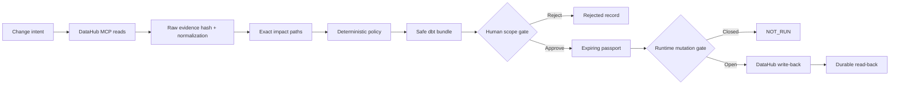

# ContextSeal

> **Every data change ships with proof, not confidence.**

ContextSeal is a DataHub-native certification agent for risky schema changes. It reads the context graph, reconstructs downstream impact, deterministically blocks unsafe action, generates a reversible dbt migration, binds scoped human approval into an expiring passport, writes the decision back to DataHub, and verifies what persisted.

[](https://github.com/zyganali-glitch/ContextSeal/actions/workflows/ci.yml)
[](LICENSE)
[](package.json)
[](docs/EVIDENCE_MANIFEST.md)

**[Open the no-install fixture walkthrough](https://zyganali-glitch.github.io/ContextSeal/)** · **[Judge path](docs/JUDGE_TEST_PATH.md)** · [Türkçe README](README.tr.md)

Built as a clean-room entry for [Build with DataHub: The Agent Hackathon](https://datahub.devpost.com/).

## Judge in two minutes

Requirements: Node.js 20 or newer. DataHub is not required for this path.

```bash
git clone https://github.com/zyganali-glitch/ContextSeal.git
cd ContextSeal
npm install
npm run validate
npm start
```

Open [http://127.0.0.1:4173](http://127.0.0.1:4173), then:

1. Select **Run local certification**.
2. See the direct `customer_email → contact_email` request score `80` and become `BLOCKED`.
3. Inspect five downstream fixture assets, full branching paths, and two clearly synthetic query signals.
4. Preview the generated dbt model, schema tests, non-colliding rollback, and owner brief.
5. Select **Approve safe plan** and inspect the `csp_...` passport and hashes.
6. Select **Prepare protected operations** and confirm all three DataHub operations remain `NOT_RUN` in fixture mode.

This proves the real local engine, API, state machine, generation, approval, and mutation boundary. It does **not** prove live DataHub, warehouse execution, production readiness, or customer impact. [Exact two-minute instructions →](docs/JUDGE_TEST_PATH.md)

## Three honest surfaces

| Surface | Experience | Evidence boundary |
| --- | --- | --- |
| GitHub Pages | Generated historical fixture walkthrough | No backend; committed `FIXTURE` snapshot |
| Local fixture | Real ContextSeal execution with synthetic graph | DataHub calls and mutations `NOT_RUN` |
| DataHub mode | Official MCP reads, normalized analysis, gated write-back, read-back | Disposable synthetic-local proof or operator-owned environment |

The UI never turns “configured for DataHub” into “verified live.” It requires a successful raw evidence hash, normalized boundary, and `PASS` context claim.

## The problem

Code review can inspect a repository. It usually cannot see that a column feeds another team's pipeline, a distant dashboard, a model-scoring workflow, privacy governance, or real query usage. A coding agent can therefore create locally correct code that is organizationally unsafe.

DataHub holds the missing schemas, lineage, ownership, governance, quality, incident, and query context. ContextSeal turns that context into a change decision and durable evidence.

## Why this is an agent

ContextSeal is not a chatbot.

Given a change intent, it autonomously:

- chooses bounded DataHub MCP tools;
- follows every discovered downstream target to an exact path;
- maintains persistent workflow state;
- applies deterministic policy;
- generates working delivery artifacts;
- stops at a scoped human authority boundary;
- performs an approved external write;
- verifies the durable result.

The loop closes:

```text
read context → decide → generate safe work → human approve/reject
             → passport → DataHub write-back → read-back verification
```

An LLM may explain a proposal in a future version. It may never overwrite evidence or policy authority.

## What it does

1. Validates a typed rename, drop, or type-change request.
2. Retrieves the exact DataHub target metadata, then paginates `list_schema_fields` to prove the complete target field set before checking the source or a generated destination.
3. Discovers bounded downstream lineage and requests an exact path for every target; every returned path and the reconstructed impact remain inside the same policy hop bound.
4. Reads inspectable dataset-query records and preserves a real zero as zero.
5. Normalizes and hashes raw MCP evidence, then recomputes the decision inputs.
6. Calculates named findings such as `BREAKING_LINEAGE`, `SENSITIVE_DATA`, `LIVE_QUERY_USAGE`, and `STALE_CONTEXT`.
7. Replaces direct destruction with expand–migrate–contract or another non-destructive strategy.
8. Generates a dbt model, YAML tests, separately named rollback, and impacted-owner brief.
9. Requires a human decision scoped to the exact manifest.
10. Creates a passport binding request, policy, context, raw evidence, impact, risk, artifacts, approval, and expiry.
11. Writes three bounded metadata changes only when every independent gate is open.
12. Separately reads back structured metadata and exact decision-document bindings.

## Architecture



[Detailed architecture →](docs/ARCHITECTURE.md) · [Threat model →](docs/THREAT_MODEL.md)

## DataHub integration

Read and path tools:

- `get_entities`
- `list_schema_fields`
- `get_lineage`
- `get_lineage_paths_between`
- `get_dataset_queries`

Approved mutation tools:

- `add_structured_properties`
- `update_description` in append mode
- `save_document`

Verification tools:

- `get_entities`
- `grep_documents`

The committed proof launches the official open-source `mcp-server-datahub` v0.6.0 package against a disposable local DataHub Core catalog. Its captured MCP handshake reports protocol `2025-03-26` and `serverInfo` name/version `datahub`/`3.4.4`; those handshake fields are distinct from the launcher package release. The seed uses native Dataset, DataJob, and Dashboard entities and no source rows. The local query tool returned zero records; ContextSeal records that honestly. Two query examples exist only in the clearly labeled fixture to demonstrate the query-risk rule.

Current committed proof: **10 MCP reads** (including one complete three-field schema page), **6 downstream assets** split as 2 Datasets / 2 DataJobs / 2 Dashboards, **6 exact paths**, and **0 query records**. Deterministic policy scored the direct request **70 / `BLOCKED`**; the approved safe alternative produced exactly **3 `PASS` mutation receipts** followed by a separate durable read-back `PASS`.

The two evidence surfaces intentionally model ML impact differently: the fixture with five downstream assets contains a clearly synthetic `ML_MODEL` node for the deterministic judge story, while the live-local seed represents MLflow scoring metadata as a native `DataJob` and makes no inference-execution claim. Counts and entity types are never mixed across those surfaces.

See [Live-local setup and proof reproduction](docs/LIVE_DATAHUB_SETUP.md) and [claim-by-claim evidence](docs/EVIDENCE_MANIFEST.md).

## Safety and integrity

### Evidence vocabulary

| State | Meaning |
| --- | --- |
| `PASS` | The named check or operation ran and passed its verification condition. |
| `WARN` | Evidence exists but is incomplete or needs attention. |
| `FAIL` | The named check ran and failed. |
| `NOT_RUN` | The check or operation did not run. |
| `STALE` | Context or certification exceeded the active freshness window. |
| `FIXTURE` | The result came from the deterministic synthetic fixture. |

### Live mutation gates

DataHub mode refuses to start without:

- a separate `CONTEXTSEAL_OPERATOR_TOKEN`;
- a non-empty exact `CONTEXTSEAL_ALLOWED_TARGET_URNS` list.

A write additionally requires verified live evidence, a fresh approved passport, unchanged policy and artifacts, no replay/in-progress/superseded state, and `DATAHUB_MCP_MUTATIONS_ENABLED=true`.

Mutation calls are never retried. Only read-only post-write verification uses bounded retries for eventual consistency.

[Full evidence boundary →](docs/EVIDENCE_BOUNDARY.md)

## Local fixture and Docker

Standard:

```bash
npm install
npm run validate
npm start
```

Docker fixture path:

```bash
docker compose up --build
```

The default container is unprivileged, capability-dropped, read-only apart from its run volume, and intended for the fixture judge path. Local stdio MCP requires `uv`/Python on the host; the image does not bundle a second runtime.

## Optional DataHub mode

Copy the example:

```powershell
Copy-Item .env.example .env
```

Minimum local shape:

```dotenv
CONTEXTSEAL_MODE=datahub
CONTEXTSEAL_HOST=127.0.0.1
# Generate a separate random value and paste it only into your local .env.
CONTEXTSEAL_OPERATOR_TOKEN=
CONTEXTSEAL_ALLOWED_TARGET_URNS=["urn:li:dataset:(urn:li:dataPlatform:snowflake,retail.gold.customers,PROD)"]
DATAHUB_MCP_TRANSPORT=stdio
DATAHUB_MCP_COMMAND=uvx
DATAHUB_MCP_ARGS=["mcp-server-datahub@0.6.0"]
DATAHUB_GMS_URL=http://localhost:8080
DATAHUB_GMS_TOKEN=
DATAHUB_MCP_MUTATIONS_ENABLED=false
```

The two short commands below are read-only preflights; they do not seed or
upsert anything:

```powershell
npm run datahub:seed
npm run datahub:properties
```

Each apply requires the preflight's exact plan hash, a generic and operation-
specific shell confirmation, and a short-lived
`DATAHUB_MCP_MUTATIONS_ENABLED=true` window. The named mutation commands are
`datahub:seed:apply` and `datahub:properties:apply`; do not run either without
the complete procedure. The helpers accept loopback GMS by default, refuse
same-URN marker conflicts, and require separate exact endpoint/URN allowlists
for remote bootstrap. Restore the mutation gate to `false` before `npm start`.

Keep mutations disabled for the first read-only run. Never commit `.env` or paste either credential into an issue, screenshot, video, run, or evidence file. [Follow the complete procedure →](docs/LIVE_DATAHUB_SETUP.md)

## Generated output

`npm run demo:generate` creates:

```text
examples/outputs/
├── demo-certification.json
├── generated/
│   ├── models/gold_customers_contextseal.sql
│   ├── models/gold_customers_contextseal.yml
│   ├── rollback/gold_customers_contextseal_rollback.sql
│   └── IMPACTED_OWNERS.md
├── live-datahub-read-evidence.json
└── live-datahub-writeback-evidence.json
```

Generation is deterministic and `npm run demo:check` fails if committed output drifts.

Evidence boundary: the four physical files under `examples/outputs/generated/` are the deterministic **fixture** artifacts. A live DataHub run generates its own four-file artifact bundle in memory and binds those exact contents and hashes inside the committed live write-back evidence. Fixture risk, query, and entity-type facts must not be attributed to the live-local run.

## Validation

```bash
npm run validate
```

The command is check-only and must leave no Git diff. It runs:

- repository/link/credential checks;
- structural committed-evidence validation;
- Node tests, including adversarial passport/MCP/write-back cases;
- deterministic demo idempotence;
- a spawned fixture server smoke flow.

CI repeats this on Node 20 and 24, then builds and smoke-tests the production container.
CI also runs `npm run datahub:safety:test` with Python 3.11 as a separate
standard-library suite for bootstrap URL, confirmation, scope, ownership, and
contract-hash gates. It is intentionally not part of the Node-only judge
`validate` path.

## Repository map

```text
src/core/       contracts, impact, policy, artifacts, passport
src/datahub/    MCP transport, live normalization, gated write-back/read-back
public/         accessible no-dependency judge dashboard
config/         versioned policy and DataHub structured-property definitions
examples/       synthetic request/graph and committed generated evidence
scripts/        generation, seed, evidence, repository, and server checks
skills/         generic executable DataHub schema-change certification skill
tests/          unit, adversarial, evidence, transport, and server integration tests
tests_py/       standard-library tests for fail-closed DataHub bootstrap gates
docs/           architecture, judging, evidence, video, setup, and submission package
docs/tr/        step-by-step Turkish operator guides
```

## Submission package

- [Devpost final copy](docs/DEVPOST_SUBMISSION.md)
- [Three-minute exact narration](docs/DEMO_SCRIPT.md)
- [Video shot list](docs/VIDEO_SHOT_LIST.md)
- [Official criteria map](docs/JUDGING_MAP.md)
- [Pre-submission checklist](docs/PRE_SUBMISSION_CHECKLIST.md)
- [Build-period disclosure](docs/BUILD_PERIOD_DISCLOSURE.md)
- [DataHub skill contribution package](docs/DATAHUB_SKILL_CONTRIBUTION.md)
- [Reusable DataHub schema-change certification skill](skills/datahub-schema-change-certification/SKILL.md)

## Current limitations

ContextSeal does not claim:

- production warehouse execution;
- automatic PR merge or deployment;
- complete lineage when DataHub has not ingested it;
- production/customer use or measured incident reduction;
- formal security certification;
- a submitted upstream DataHub Skills PR until a public PR URL exists.

The live normalizer currently certifies asset-level paths and validates source/destination fields against complete paginated target-schema evidence. Column-level path expansion is future work.

## License

Apache License 2.0. See [LICENSE](LICENSE).
