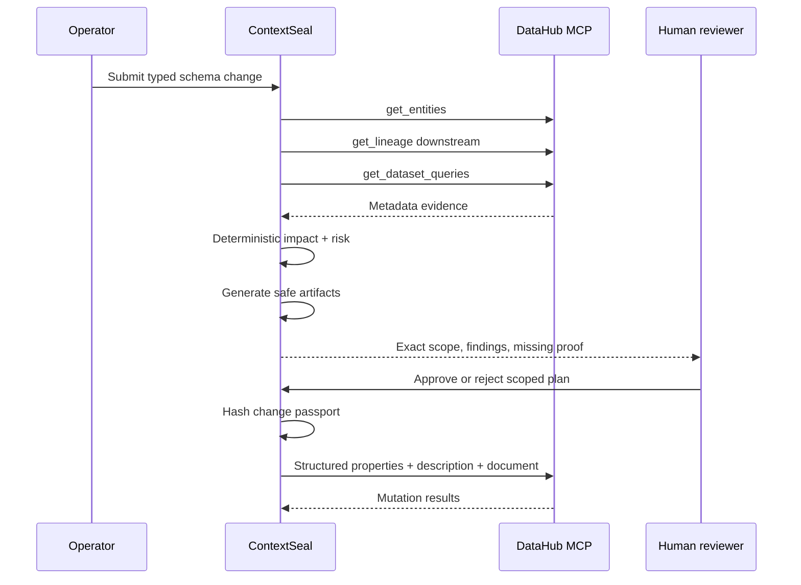

# Architecture

ContextSeal separates deterministic authority from external context and human judgment.

## Components

1. **Change contract** — accepts only rename, drop, and type-change requests with explicit target URN, field, requester, and rationale.
2. **DataHub context adapter** — uses MCP to collect entity, lineage, and observed-query evidence. Raw live evidence is preserved separately from normalized graph fixtures.
3. **Impact engine** — performs bounded breadth-first traversal and records the full path to every downstream asset.
4. **Policy engine** — calculates named findings and a score from versioned `config/policy.json` rules.
5. **Artifact generator** — produces a staged dbt model, schema tests, rollback, and owner briefing. It does not issue a direct destructive rename/drop.
6. **Human gate** — records decision, reviewer, note, time, and accepted scope.
7. **Passport engine** — hashes the request, context, every artifact, approval, and evidence manifest.
8. **Write-back adapter** — prepares and, only when enabled, invokes DataHub mutation tools.
9. **Run store** — keeps local JSON run records and an append-only JSONL event stream.
10. **Judge dashboard** — renders the same API results used by tests; no separate hard-coded success logic exists in the browser.

## State machine

```text
REQUESTED
  -> AWAITING_HUMAN
      -> REJECTED
      -> APPROVED_FOR_WRITEBACK
          -> CERTIFIED_AND_WRITTEN_BACK   (live mode + mutation gate)
          -> WRITEBACK_FAILED             (partial results preserved, execution stops)
          -> NOT_RUN                      (fixture or disabled mutation gate)
```

Risk verdict and workflow state are intentionally separate. A direct request may be `BLOCKED` while the generated non-destructive alternative is eligible for scoped human approval.

## Data flow



## Why no framework dependency?

The competition surface uses Node.js built-ins so judges can install and run it quickly, the browser has no third-party runtime requests, and the policy logic remains directly inspectable. DataHub remains the external context system and durable metadata destination.
