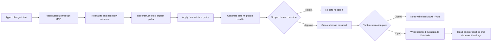
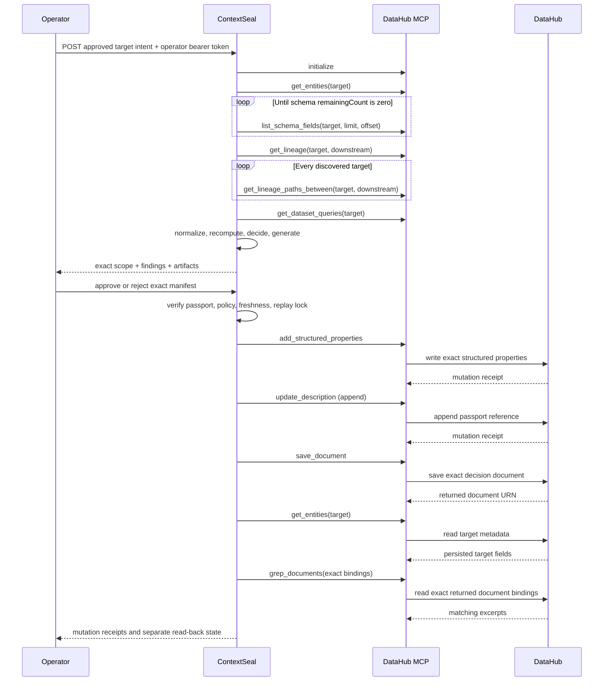

# Architecture

ContextSeal is a bounded, stateful certification agent. DataHub supplies organizational context; deterministic code remains the decision authority; a human controls the exact mutation scope.

## Agent loop



This is an agent rather than a chatbot because it accepts an intent, chooses and invokes bounded tools, maintains a state machine, produces working artifacts, pauses for a human authority boundary, acts on an external system, and verifies the result. It does not merely answer a question.

## Components

1. **Change contract** — accepts rename, drop, and type-change requests with an explicit target, field, requester, and rationale. It rejects unsafe identifiers, missing destinations, same-field renames, and live destination collisions.
2. **MCP client** — supports the official local stdio server and streamable HTTP. It validates JSON-RPC correlation, timeouts, tool-level errors, and never exposes subprocess stderr.
3. **Live collector** — retrieves target governance metadata, exhausts unfiltered `list_schema_fields` pagination, discovers downstream assets, requests one exact path per asset, and collects dataset-query evidence. Missing pages, stalled offsets, inconsistent counts, duplicates, or uninspectable fields fail closed.
4. **Normalizer** — treats `list_schema_fields` as the field-existence authority while `get_entities` remains the metadata/governance authority. It converts raw DataHub payloads into the deterministic graph contract and cross-checks the raw-evidence hash, complete schema, endpoint set, and hop bound.
5. **Impact engine** — performs bounded traversal, preserves each downstream path, and must produce exactly the endpoint set discovered by the bounded MCP lineage call before live evidence can be `PASS`.
6. **Policy engine** — calculates named findings from `config/policy.json`. Model-generated prose cannot change the score or evidence state.
7. **Artifact generator** — produces a dbt model, schema tests, a separately named rollback model, and an owner brief. Direct destructive SQL is never generated.
8. **Human gate** — records the exact reviewer, note, decision, scope, and decision time.
9. **Passport engine** — binds request, policy, context, raw MCP evidence, impact, risk, artifacts, approval, and validity into a SHA-256 manifest.
10. **Write-back adapter** — compares canonical operations, invokes exactly three mutation tools, preserves partial receipts, and never retries mutations.
11. **Read-back verifier** — retries read-only checks within a bounded deadline to tolerate eventual consistency.
12. **Run store** — persists run snapshots and an event log; replay and superseded states are rejected.
13. **Dashboard** — renders the same API run contract used by tests, with separate hosted, fixture, unverified-live, and verified-live modes.

## Live call graph



## State model

```text
AWAITING_HUMAN
  ├─ REJECTED
  ├─ SUPERSEDED
  └─ APPROVED_FOR_WRITEBACK
       ├─ fixture / gate closed -> mutation evidence stays NOT_RUN
       ├─ WRITEBACK_IN_PROGRESS
       │    ├─ CERTIFIED_AND_WRITTEN_BACK
       │    ├─ WRITEBACK_VERIFICATION_FAILED
       │    └─ WRITEBACK_FAILED
       └─ STALE passport -> rejected before mutation
```

The direct-request risk verdict and workflow state are intentionally separate. A rename can be `BLOCKED` as requested while its generated expand–migrate–contract alternative is eligible for scoped approval.

## Security boundary

- Fixture mode is the default and needs no credential.
- DataHub mode defaults to loopback, requires a separate ContextSeal operator bearer token, and accepts only allowlisted target URNs.
- The DataHub credential remains backend-only.
- Enabling MCP mutation tools does not bypass passport, approval, freshness, policy, artifact, target, or replay checks.
- Mutation calls are never retried. Only read-back verification has bounded retries.
- The included Docker image is optimized for the fixture judge path. Local stdio MCP additionally requires `uv` and Python on the host; remote HTTP MCP can be configured separately.

## Why a dependency-light runtime?

The application uses Node.js built-ins and a no-framework browser so judges can inspect and run the core quickly. DataHub remains the external context graph and durable memory layer; the small runtime keeps the safety contract visible instead of hiding it behind framework behavior.
